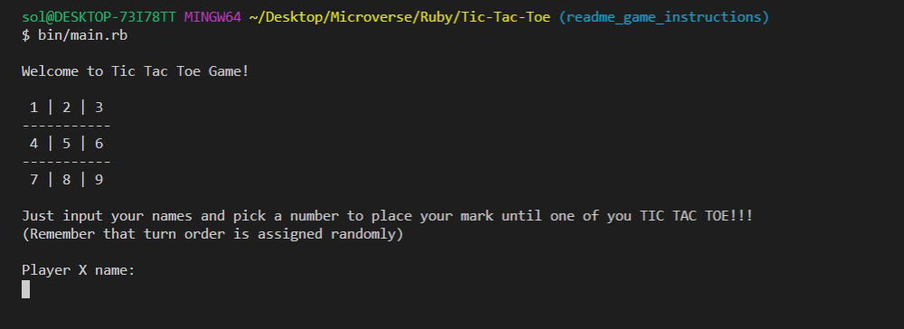
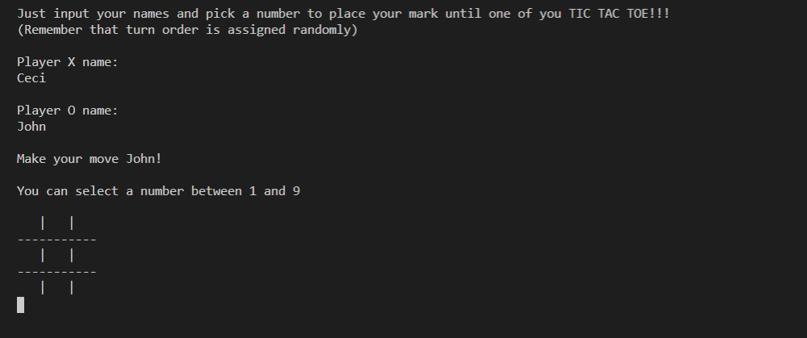
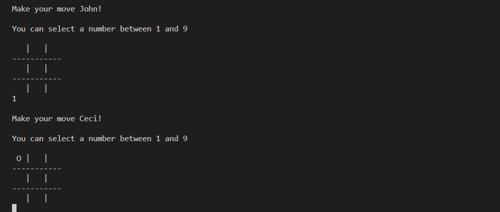
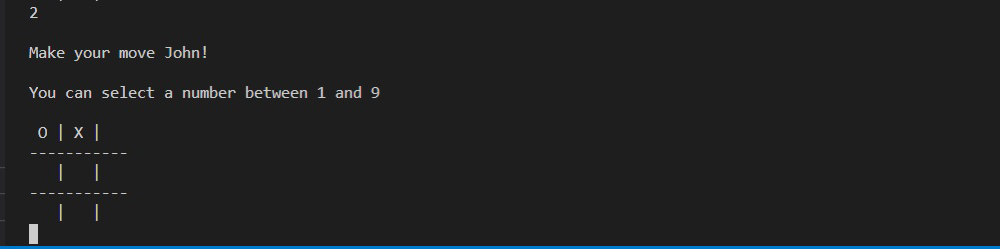
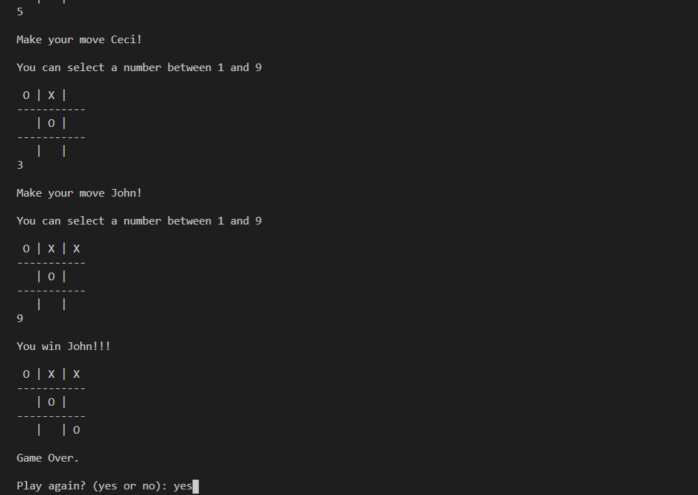

#  🧐 Tic Tac Toe

This is the third collaborative project from the Ruby module from the Microverse program it consists on 5 Milestones, in where we will recreate the well known Tic Tac Toe game with User Interface, Game Logic, and OOP principles, we also are going to incorporate some test driven development at the end of the project.

## Game rules: 
- The instructions of the game are displayed at the beginning of the game. The game board consists of 3 by 3 grid and 9 locations.

- Two players are requested to enter their name.

- The players can choose between the 'X' or 'O' mark, the player that makes the first move is chosen randomly.

- You only can enter numbers from 1 to 9, no letters allowed and no player can move in a place which is already taken.

- The game board will check for a winner after the first 4 moves and if no player wins it's a draw.

- Players can choose to play again and set the players with new values.

## 🔧 Built With

- Ruby.
- Using Rubocop Linters.
- OOP.

## 🔴 Live Demo

[Live Demo Link](https://repl.it/join/eofczofa-cecibenitez)


## 🛠 Getting Started

## Install 
Besides the live demo link, you can run those functions in you own local environment. In order to run, you need to install Ruby in your computer. For windows you can go to [Ruby installer](https://rubyinstaller.org/) and for MAC and LINUX you can go to [Ruby official site](https://www.ruby-lang.org/en/downloads/) for intructions on how to intall it. Then you can clone the project by typing ```git clone https://github.com/Ceci007/Tic-Tac-Toe.git```

To get a local copy up and running follow these simple example steps.

- Go to the main page of te repo.
- Press the "Code" button and get the repo link.
- Clone it using git.

## Run the game 
Type ```bin/main.rb``` in the root file of the project. You can also type ```ruby bin/main.rb``` in the root file of the project.

## ✒️ Authors

👤 **Cecilia Benitez**

- Github: [@Ceci007](https://github.com/Ceci007)
- LinkedIn:[LinkedIn](https://www.linkedin.com/in/cecilia-ben%C3%ADtez-casaccia-498669185/)

👤 **John Elvis Duran**

- Github: [@jelduran](https://github.com/jelduran)
- LinkedIn:[LinkedIn](www.linkedin.com/in/jelduran)

## 🤝 Contributing

Contributions, issues and feature requests are welcome!

Feel free to check the [issues page](https://github.com/Ceci007/Tic-Tac-Toe/issues).

## 📝 License

This project is [MIT](lic.url) licensed.

